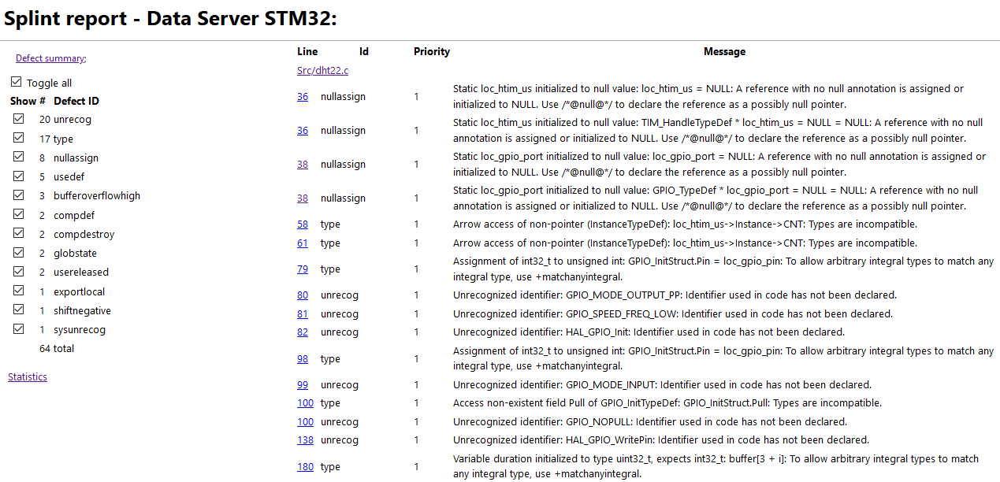
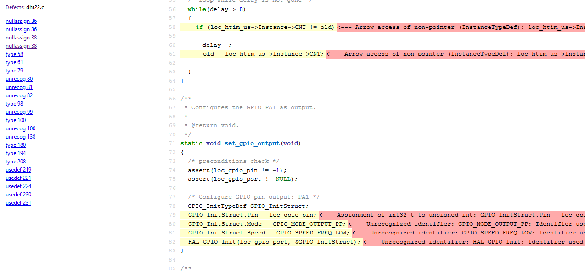

# Splint Html Report

This is a little utility to generate a html report of a CSV file produced by [splint](https://github.com/splintchecker/splint).

The utility is a copy-paste-customize project of a well known [cppcheck-htmlreport](https://github.com/danmar/cppcheck/tree/main/htmlreport).

# Output Examples

## Main Page

## Details for a Selected File

# License

The original project [cppcheck-htmlreport](https://github.com/danmar/cppcheck/tree/main/htmlreport) is published under the `GPL-3.0 License`. We keep the same license for `splint-htmlreport` project. For more details refer to the [LICENSE](LICENSE) file.